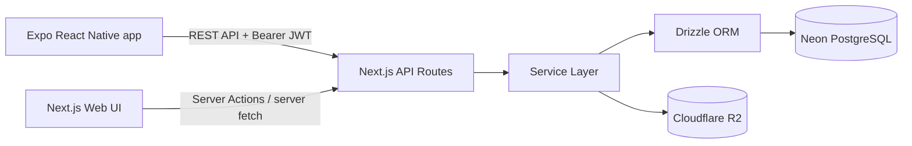
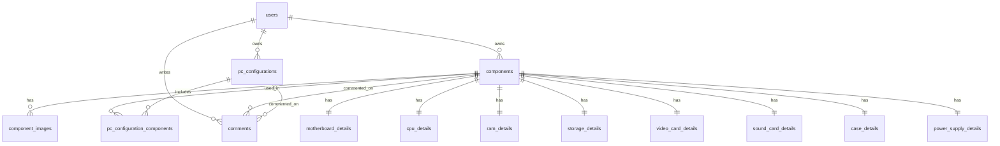

# PCConfigHub

PCConfigHub е full-stack приложение за създаване, проверка и споделяне на PC конфигурации. Проектът е изграден като Node.js monorepo с Next.js web/backend приложение, Expo мобилен клиент и споделен пакет.

## Live проекти

| Проект | URL |
| --- | --- |
| Web + Backend | https://pcconfighub.netlify.app/ |
| Expo Web Export | https://pcconfighub-mobile.netlify.app/ |
| GitHub | https://github.com/antonpetrv2/PCConfigHub |

## Тестови данни

| Роля | Email | Парола |
| --- | --- | --- |
| Admin | `admin@pcconfighub.local` | `Admin-v261zn8E3vWo!` |

## Какво прави приложението

Потребителите могат да разглеждат каталог от реални PC части, да създават свои конфигурации, да проверяват базова съвместимост между избраните части и да публикуват конфигурации. Администраторите управляват потребители, роли и съдържание, което чака одобрение.

Основни възможности:

- регистрация, вход и изход с JWT;
- роли `admin`, `moderator` и `user`;
- каталог с дънни платки, процесори, RAM, SSD, GPU, звукови карти, кутии и захранвания;
- създаване, редакция и изтриване на PC конфигурации;
- публични и частни конфигурации;
- approval workflow за публично съдържание;
- качване и изтриване на изображения през Cloudflare R2/S3-compatible storage;
- REST API за мобилния клиент;
- Server Actions и server-side rendering за web клиента;
- paging в API и UI за големи списъци.

## Архитектура



Проектът използва client-server архитектура:

- `pc-config-hub-web` съдържа Next.js backend API, web UI, Server Actions, Drizzle schema и migrations.
- `pc-config-hub--mobile` съдържа Expo Router mobile client, който комуникира с backend-а през REST API.
- `pc-config-hub-shared` е подготвен за споделен TypeScript код между клиентите.
- `netlify-mobile-static` е helper проект за prebuilt Netlify deploy на Expo web export.

## Технологии

| Част | Технологии |
| --- | --- |
| Backend | Next.js API Routes, TypeScript, Zod |
| Database | Neon PostgreSQL, Drizzle ORM, Drizzle migrations |
| Web | Next.js, React, TypeScript, Tailwind CSS |
| Mobile | React Native, Expo, Expo Router |
| Auth | JWT с `jose`, bcrypt password hashing |
| Storage | Cloudflare R2 чрез AWS S3 client |
| Deploy | Netlify |

## Web екрани

Web приложението има минимум 10 реални screens/routes:

- `/` home;
- `/login`;
- `/register`;
- `/setup-admin`;
- `/catalog`;
- `/parts`;
- `/builder`;
- `/configurations`;
- `/configurations/[id]`;
- `/admin/users`.

## Mobile екрани

Мобилното приложение има минимум 5 реални Expo Router screens:

- `/` home;
- `/login`;
- `/configurations`;
- `/builder`;
- `/profile`.

Мобилният клиент покрива най-важната end-user функционалност: login/logout, списък с конфигурации, създаване/редакция на build и профилна информация.

## API overview

REST API routes са в `pc-config-hub-web/src/app/api`.

| Endpoint | Методи | Описание |
| --- | --- | --- |
| `/api/auth/register` | `POST` | Регистрация на потребител |
| `/api/auth/login` | `POST` | Login, връща JWT token |
| `/api/auth/logout` | `POST` | Logout |
| `/api/auth/me` | `GET` | Текущ потребител |
| `/api/parts` | `GET`, `POST` | Списък и създаване на части |
| `/api/parts/[id]` | `GET`, `PUT`, `DELETE` | Детайли, редакция и изтриване на част |
| `/api/configs` | `GET`, `POST` | Списък и създаване на конфигурации |
| `/api/configs/[id]` | `GET`, `PUT`, `DELETE` | Детайли, редакция и изтриване на конфигурация |
| `/api/configs/check-compatibility` | `POST` | Проверка за съвместимост |
| `/api/upload` | `POST` | Качване на файл в R2 |
| `/api/admin/pending` | `GET` | Pending съдържание за review |
| `/api/admin/users` | `GET` | Admin списък с потребители |
| `/api/admin/*/approve` | `POST` | Одобряване на съдържание |
| `/api/admin/*/reject` | `POST` | Отхвърляне на съдържание |
| `/api/docs` | `GET` | HTML API документация |

Списъчните endpoints поддържат paging чрез `page` и `limit`, например:

```text
/api/parts?page=1&limit=20
/api/configs?page=2&limit=20
```

## Database schema

Drizzle schema: `pc-config-hub-web/src/db/schema.ts`

Migrations:

- `pc-config-hub-web/drizzle/0000_funny_juggernaut.sql`
- `pc-config-hub-web/drizzle/0001_fair_leech.sql`

Seed scripts:

- `pc-config-hub-web/drizzle/seed.sql` - малък demo seed;
- `pc-config-hub-web/drizzle/performance-seed.sql` - 10 000 реалистични PC части и 10 000 конфигурации за performance/paging тестове.

Основни таблици:

- `users` - потребители, password hash, роли, approval status;
- `components` - обща таблица за PC части;
- `motherboard_details`, `cpu_details`, `ram_details`, `storage_details`, `video_card_details`, `sound_card_details`, `case_details`, `power_supply_details` - нормализирани детайли по тип част;
- `component_images` - изображения към части;
- `pc_configurations` - запазени PC конфигурации;
- `pc_configuration_components` - връзка много-към-много между конфигурации и части;
- `comments` - коментари към части или конфигурации;
- `import_batches`, `import_rows` - проследяване на import/seed операции.

ER diagram:



## Repo структура

```text
.
├── AGENTS.MD
├── PROJECT-DESCRIPTION.md
├── README.md
├── package.json
├── pc-config-hub-web/
│   ├── src/app/                 # Next.js pages, API routes, layouts
│   ├── src/actions/             # Server Actions
│   ├── src/db/                  # Drizzle client and schema
│   ├── src/lib/                 # auth, JWT, API helpers
│   ├── src/services/            # business logic and DB access
│   ├── drizzle/                 # migrations and seed scripts
│   ├── docs/                    # API docs and ER diagram
│   └── netlify.toml
├── pc-config-hub--mobile/
│   ├── src/app/                 # Expo Router screens
│   ├── src/auth/                # mobile auth context
│   ├── src/components/          # reusable mobile UI
│   ├── src/services/            # REST API client
│   ├── dist/                    # committed Expo web export for Netlify
│   └── netlify.toml
├── pc-config-hub-shared/
│   └── src/
└── netlify-mobile-static/
    └── build.js                 # copies Expo dist for Netlify deploy
```

## Local setup

Изисквания:

- Node.js 20+;
- npm;
- PostgreSQL/Neon database URL;
- Cloudflare R2 bucket за uploads, ако ще се тества upload функционалност.

Инсталация:

```bash
npm install
```

Web development:

```bash
cd pc-config-hub-web
npm run dev
```

Mobile development:

```bash
npm run dev --workspace pc-config-hub--mobile
```

Build checks:

```bash
cd pc-config-hub-web
npm run build --workspaces=false
cd ..
npm run build --workspace pc-config-hub--mobile
```

Database migrations:

```bash
cd pc-config-hub-web
npm run db:migrate
```

Base seed:

```bash
psql "$DATABASE_URL" -f drizzle/seed.sql
```

Performance seed with 10 000 real-world part records:

```bash
psql "$DATABASE_URL" -f drizzle/performance-seed.sql
```

## Environment variables

Web / backend:

```env
DATABASE_URL=
JWT_SECRET=
R2_URL=
R2_BUCKET_NAME=
R2_PUBLIC_URL=
R2_ACCESS_KEY_ID=
R2_SECRET_ACCESS_KEY=
```

Mobile deploy:

```env
EXPO_PUBLIC_API_URL=https://pcconfighub.netlify.app/api
API_URL=https://pcconfighub.netlify.app/api
```

## Deployment

### Web Netlify project

- Base directory: `pc-config-hub-web`
- Build command: `npm run build --workspaces=false`
- Publish directory: `.next`
- Config file: `pc-config-hub-web/netlify.toml`
- Required env vars: `DATABASE_URL`, `JWT_SECRET`, `R2_URL`, `R2_BUCKET_NAME`, `R2_PUBLIC_URL`, `R2_ACCESS_KEY_ID`, `R2_SECRET_ACCESS_KEY`
- Keep `NPM_FLAGS="--workspaces=false --include=optional"` so Netlify installs only web dependencies and includes native optional packages.

### Mobile Netlify project

The Expo app is deployed as a prebuilt static export.

Local build before deploy:

```bash
npm run build --workspace pc-config-hub--mobile
```

Netlify settings:

- Base directory: `netlify-mobile-static`
- Build command: `npm run build --workspaces=false`
- Publish directory: `netlify-mobile-static/.next`
- Required env vars: `EXPO_PUBLIC_API_URL`, `API_URL`

`netlify-mobile-static/build.js` copies `../pc-config-hub--mobile/dist` into `.next` and patches localhost API URLs to the deployed backend API URL.

## Notes for evaluators

- The GitHub history contains more than 15 commits across more than 3 different days.
- The web app and mobile app are deployed separately and both connect to the same backend API.
- The production API returns paging metadata: `total`, `page`, `limit`.
- `performance-seed.sql` is included specifically to demonstrate large dataset support with real PC part model names.
