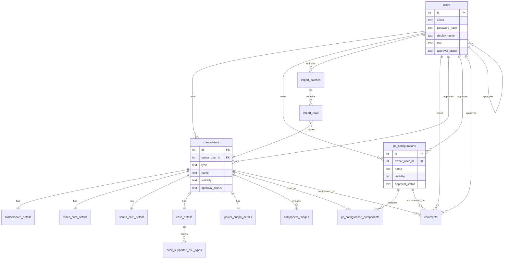

# ER Diagram

```mermaid
erDiagram
  users ||--o{ components : owns
  users ||--o{ pc_configurations : owns
  users ||--o{ import_batches : uploads
  users ||--o{ comments : writes
  users ||--o{ components : approves
  users ||--o{ pc_configurations : approves
  users ||--o{ comments : approves
  users ||--o{ users : approves

  components ||--|| motherboard_details : has
  components ||--|| video_card_details : has
  components ||--|| sound_card_details : has
  components ||--|| case_details : has
  components ||--|| power_supply_details : has
  case_details ||--o{ case_supported_psu_types : allows
  components ||--o{ component_images : images
  components ||--o{ pc_configuration_components : used_in
  pc_configurations ||--o{ pc_configuration_components : includes
  components ||--o{ comments : commented_on
  pc_configurations ||--o{ comments : commented_on

  import_batches ||--o{ import_rows : contains
  import_rows }o--|| components : creates

  users {
    int id PK
    text email
    text password_hash
    text display_name
    text role
    text approval_status
  }

  components {
    int id PK
    int owner_user_id FK
    text type
    text name
    text visibility
    text approval_status
  }

  pc_configurations {
    int id PK
    int owner_user_id FK
    text name
    text visibility
    text approval_status
  }
```
